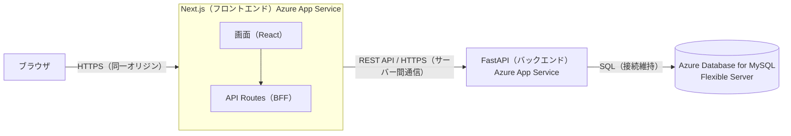
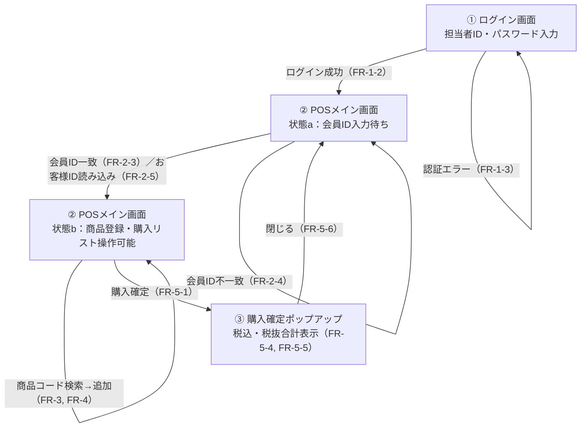
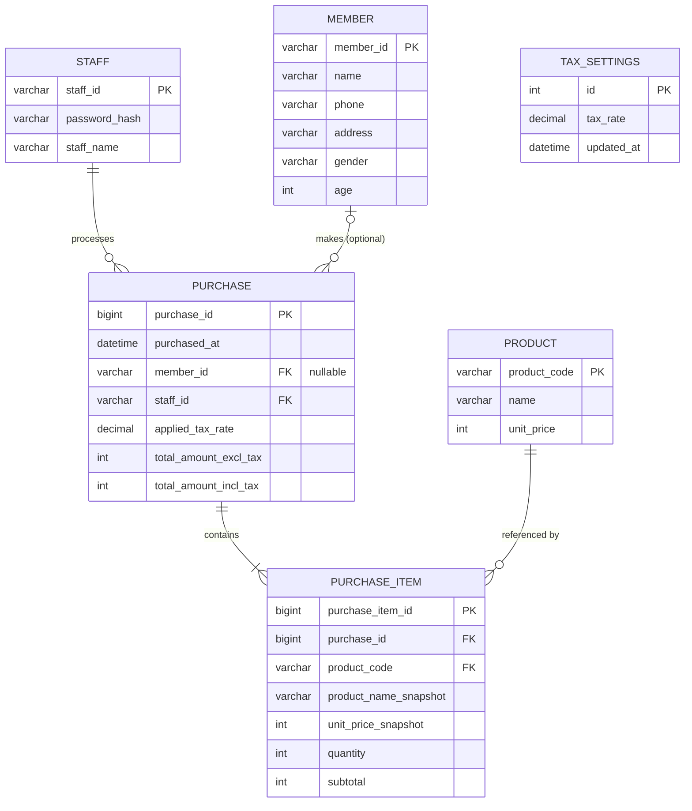
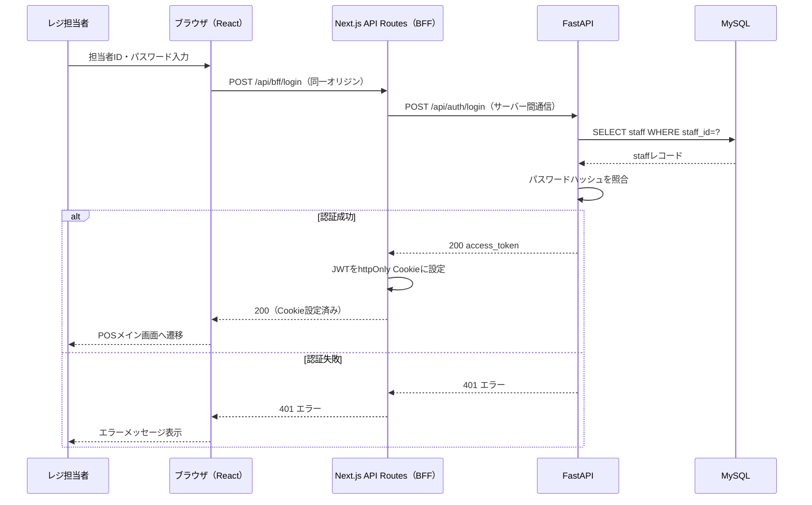
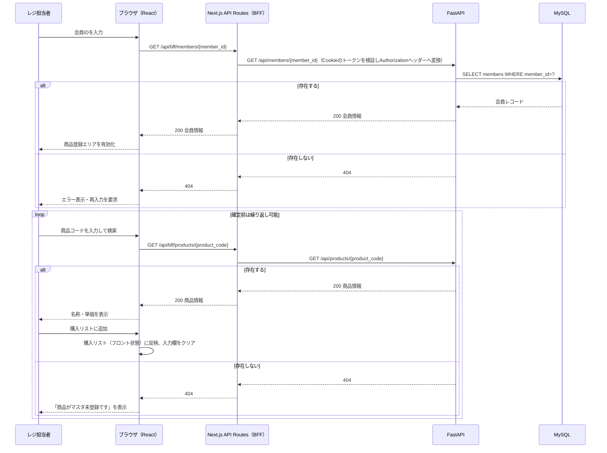
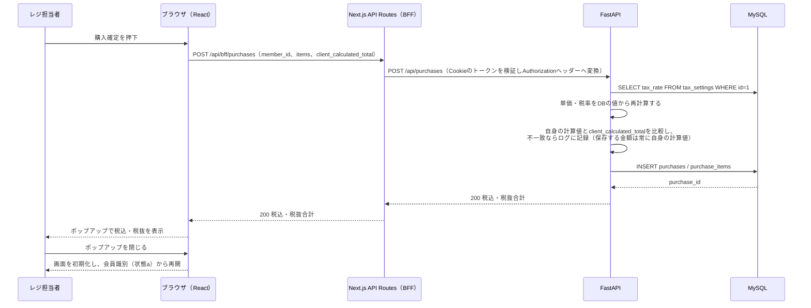
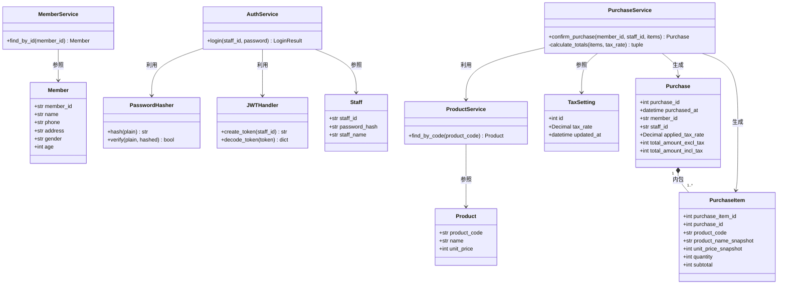
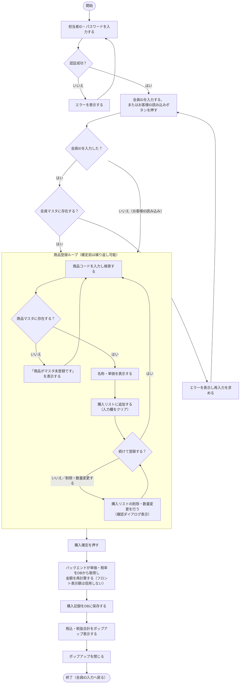

# 簡易POSアプリ（初級編）仕様設計書

*―要件定義書 v1.0 に基づく実装設計―*

| 項目 | 内容 |
|---|---|
| 文書名 | 簡易POSアプリ（初級編）仕様設計書 |
| 版数 | v1.1（ドラフト） |
| 作成日 | 2026年9月8日 |
| 作成者 | 橋本 悠保 |
| 元資料 | 簡易POSアプリ（初級編）要件定義書 v1.0 |
| 提出先 | 講師 |

---

## 1. 本書について

本書は、「簡易POSアプリ（初級編）要件定義書 v1.0」（以下「要件定義書」）でスコープ外としていた実装設計、すなわちAPI仕様・画面遷移・データベーステーブル設計を具体化する仕様設計書である。要件定義書の各機能要件（FR）・非機能要件（NFR）に対応させながら、実装に着手できる粒度まで設計を落とし込む。

v1.1では、UML図（クラス図・アクティビティ図）の追加と、Webアプリケーションのセキュリティ設計（認証・認可、BFF、CORS、金額計算の検証、SQLインジェクション対策、依存ライブラリの脆弱性管理）を新たに盛り込んだ。課題で提示された各項目への対応状況は12章に一覧化している。

対象読者は本演習の講師、および本書をもとに実装を行う開発チーム自身を想定する。要件定義書と同様、本書で行った設計判断とその理由は付録Aに記録する。

## 2. システム構成（アーキテクチャ）

要件定義書3〜4章の前提・方針に基づき、以下の構成とする。



- フロントエンド（Next.js）は画面描画（React）とBFF（API Routes、サーバーサイド）を兼ねる。ブラウザは常にNext.js自身（同一オリジン）にのみリクエストを送り、FastAPIへの実際の呼び出しはBFFがサーバー間通信として代行する（7.2節参照）。
- バックエンド（FastAPI）は別のAzure App Serviceとしてデプロイし、BFFからの呼び出しのみを受け付ける想定とする。
- バックエンドとDBの接続は、SQLAlchemyのコネクションプールを用いてある程度維持する（8章参照）。
- 商品マスタ・会員マスタは、外部の別システムではなく、本システムと同一のAzure Database for MySQL Flexible Server内のテーブルとして保持する（付録A参照）。初期データはアプリのUIからではなく、シードデータ（INSERT文等）で投入する。

## 3. 画面遷移設計

要件定義書5章の機能要件をもとに、以下の2画面＋1モーダル（購入確定ポップアップ）の合計3つの表示単位で構成する。



| 画面 | 主な要素 | 対応する主なFR |
|---|---|---|
| ①ログイン画面 | 担当者ID入力欄、パスワード入力欄、ログインボタン、エラーメッセージ表示 | FR-1-1〜FR-1-3 |
| ②POSメイン画面（状態a） | 会員ID入力欄、お客様ID読み込みボタン、担当者情報表示、エラーメッセージ表示 | FR-2-1〜FR-2-5 |
| ②POSメイン画面（状態b） | 商品コード入力欄、検索ボタン、名称・単価表示、購入リスト（削除・数量変更操作を含む）、購入確定ボタン | FR-3-1〜FR-4-9 |
| ③購入確定ポップアップ | 税込合計、税抜合計、閉じるボタン | FR-5-4〜FR-5-6 |

> 注記：要件定義書は画面数を明示していなかったため、「ログイン画面」と「会員ID入力〜商品登録・購入を行うPOSメイン画面（1画面、状態で表示を切り替える）」の2画面＋確認ポップアップという構成に設計側で決定した（付録A参照）。

## 4. データベース設計

要件定義書7章のデータ要件を、Azure Database for MySQL Flexible Server上のテーブルとして具体化する。



`TAX_SETTINGS`は他テーブルと外部キーで結びつけない。運用上は常に`id = 1`の1行のみを保持し、税率を変更する際は新しい行をINSERTするのではなく、その1行を`UPDATE`で上書きする（8章NFR-3-1の「UPDATEするだけで反映される」という実現方式と整合させるため）。購入確定時はこの1行から税率を読み取り、`PURCHASE.applied_tax_rate`に複製する（税率が将来変わっても過去の購入記録の税率は変化しない）。

### テーブル定義（DDL）

```sql
CREATE TABLE products (
  product_code VARCHAR(20) PRIMARY KEY,
  name VARCHAR(100) NOT NULL,
  unit_price INT NOT NULL
);

CREATE TABLE members (
  member_id VARCHAR(20) PRIMARY KEY,
  name VARCHAR(100) NOT NULL,
  phone VARCHAR(20),
  address VARCHAR(255),
  gender VARCHAR(10),
  age INT
);

CREATE TABLE staff (
  staff_id VARCHAR(20) PRIMARY KEY,
  password_hash VARCHAR(255) NOT NULL,
  staff_name VARCHAR(100) NOT NULL
);

-- 常に id=1 の1行のみを保持する運用とする（税率変更はUPDATEのみ、INSERTは行わない）
CREATE TABLE tax_settings (
  id INT PRIMARY KEY,
  tax_rate DECIMAL(5,4) NOT NULL,
  updated_at DATETIME NOT NULL DEFAULT CURRENT_TIMESTAMP ON UPDATE CURRENT_TIMESTAMP
);

CREATE TABLE purchases (
  purchase_id BIGINT PRIMARY KEY AUTO_INCREMENT,
  purchased_at DATETIME NOT NULL DEFAULT CURRENT_TIMESTAMP,
  member_id VARCHAR(20) NULL,
  staff_id VARCHAR(20) NOT NULL,
  applied_tax_rate DECIMAL(5,4) NOT NULL,
  total_amount_excl_tax INT NOT NULL,
  total_amount_incl_tax INT NOT NULL,
  FOREIGN KEY (member_id) REFERENCES members(member_id) ON DELETE RESTRICT,
  FOREIGN KEY (staff_id) REFERENCES staff(staff_id) ON DELETE RESTRICT
);

CREATE TABLE purchase_items (
  purchase_item_id BIGINT PRIMARY KEY AUTO_INCREMENT,
  purchase_id BIGINT NOT NULL,
  product_code VARCHAR(20) NOT NULL,
  product_name_snapshot VARCHAR(100) NOT NULL,
  unit_price_snapshot INT NOT NULL,
  quantity INT NOT NULL,
  subtotal INT NOT NULL,
  FOREIGN KEY (purchase_id) REFERENCES purchases(purchase_id),
  FOREIGN KEY (product_code) REFERENCES products(product_code) ON DELETE RESTRICT
);
```

`purchase_items`に`product_name_snapshot`・`unit_price_snapshot`を持たせているのは、将来`products`側の名称・単価が変わっても、過去の購入記録の表示内容が変化しないようにするためである（付録A参照）。

## 5. API設計

以下に定義するのはFastAPI（バックエンド）側の内部エンドポイントであり、ブラウザから直接呼び出されることはない。ブラウザはNext.jsの同一オリジンAPI Routes（BFF）を呼び出し、BFFがサーバー間通信としてこれらのエンドポイントを呼び出す（7.2節参照）。認証が必要なエンドポイントは`Authorization: Bearer <JWT>`ヘッダーを必須とする。なお、本番環境では`/docs`等のAPI仕様書は非公開とする（7.5節参照）。

| メソッド／パス | 概要 | 対応する主なFR |
|---|---|---|
| `POST /api/auth/login` | 担当者ID・パスワードでログインし、JWTを発行する | FR-1-1〜FR-1-3 |
| `GET /api/members/{member_id}` | 会員IDから会員情報を取得する | FR-2-3, FR-2-4 |
| `GET /api/products/{product_code}` | 商品コードから商品情報を取得する | FR-3-2, FR-3-3 |
| `POST /api/purchases` | 購入リストの内容を確定し、購入記録を保存する | FR-5-1〜FR-5-5, FR-6-3 |

### 5.1 POST /api/auth/login

リクエスト:

```json
{
  "staff_id": "S001",
  "password": "plain-text-password"
}
```

レスポンス（200）:

```json
{
  "access_token": "xxxxx.yyyyy.zzzzz",
  "token_type": "bearer",
  "staff_name": "山田太郎"
}
```

レスポンス（401）：担当者IDまたはパスワードが誤っている場合。どちらが誤りかは特定できないよう、共通のメッセージとする。

```json
{ "detail": "担当者IDまたはパスワードが正しくありません" }
```

発行するJWTの有効期限は8時間（レジの1勤務時間帯を想定）とする。有効期限が切れた状態でAPIを呼び出した場合、バックエンドは401を返し、フロントエンドはログイン画面に戻す（9章参照）。JWTの発行・検証方式は7.1節に定める。

### 5.2 GET /api/members/{member_id}

レスポンス（200）:

```json
{ "member_id": "M0001", "name": "鈴木花子" }
```

レスポンス（404）：会員マスタに存在しない場合。

```json
{ "detail": "会員が見つかりません" }
```

### 5.3 GET /api/products/{product_code}

レスポンス（200）:

```json
{ "product_code": "P0001", "name": "おにぎり", "unit_price": 150 }
```

レスポンス（404）：商品マスタに存在しない場合。

```json
{ "detail": "商品がマスタ未登録です" }
```

### 5.4 POST /api/purchases

購入リスト（確定前の状態）はフロントエンド側で保持し、確定操作のタイミングでまとめて送信する（付録A参照）。担当者IDはリクエストボディに含めず、認証トークンから特定する。フロントエンドが画面表示用に計算した金額も参考値として送信するが、DBに保存・レスポンスする金額は常にバックエンドがDBの値から独自に再計算した値とする（7.4節参照）。

リクエスト:

```json
{
  "member_id": "M0001",
  "items": [
    { "product_code": "P0001", "quantity": 2 },
    { "product_code": "P0002", "quantity": 1 }
  ],
  "client_calculated_total_excl_tax": 450,
  "client_calculated_total_incl_tax": 495
}
```

`member_id`は、お客様ID読み込みボタン経由（会員なし）の場合は`null`を送る。`client_calculated_total_excl_tax`・`client_calculated_total_incl_tax`はフロントエンドが画面表示のために計算した参考値であり、金額の確定には使用しない（7.4節参照）。

レスポンス（200）:

```json
{
  "purchase_id": 10234,
  "applied_tax_rate": 0.10,
  "total_amount_excl_tax": 450,
  "total_amount_incl_tax": 495
}
```

`purchase_id`は購入確定ポップアップには表示しない（3章参照）。将来的なレシート再発行や問い合わせ対応（いずれも本書ではスコープ外）のために、内部識別子として返却しておく。

レスポンス（400）：商品コードが存在しない、数量が1未満、など入力内容に不備がある場合。数量0以下の商品は通常フロントエンド側で購入リストから除かれる（FR-4-9）ため、この検証はAPIを直接呼び出された場合等に備えた防御的なチェックである。

## 6. 主要処理のシーケンス設計

BFFを介した構成（2章参照）を踏まえ、ブラウザ（UI）→BFF→バックエンド（BE）→DBの順で表す。

### 6.1 ログイン（FR-1-1〜FR-1-3）



### 6.2 会員識別〜商品登録（FR-2〜FR-4）



お客様ID読み込みボタンを押した場合は、`GET /api/members/{member_id}`を呼び出さず、`member_id`を未設定のまま商品登録エリアを有効化する。

### 6.3 購入確定（FR-5-1〜FR-5-6）



## 7. セキュリティ設計

講義で扱われたWebアプリケーションのセキュリティ対策を、本アプリの構成に即して具体化する。

### 7.1 認証・認可

- **認証**：担当者ID・パスワードによるログイン成功時にJWTを発行する（5.1節）。署名・検証にはPyJWTを用い、検証（`jwt.decode()`）の際は`algorithms=["HS256"]`のように許可するアルゴリズムを明示的に指定し、アルゴリズム混同攻撃（`alg=none`等でトークン検証を回避する攻撃）を防ぐ。署名鍵はソースコード・リポジトリに含めず、Azure App Serviceのアプリケーション設定（環境変数）で管理する。
- **認可**：本アプリの利用者ロールは「レジ担当者」の1種類のみであるため、ロールベースのアクセス制御（RBAC）は行わない。`/api/members/*`・`/api/products/*`・`/api/purchases`の各エンドポイントは、有効なJWTが付与されているか否かのみを認可判定基準とする（`/api/auth/login`のみ認証不要）。
- JWTの有効期限は8時間とする（8章参照）。有効期限切れの場合の挙動は9章に定める。

### 7.2 BFF（Backend for Frontend）／リバースプロキシ

ブラウザからのAPI呼び出しは、すべてNext.js自身の同一オリジンAPI Routes（BFF）を経由させ、ブラウザから直接FastAPIを呼び出させない構成とする（2章・6章参照）。

| ブラウザが呼ぶBFFエンドポイント | BFFが内部で呼び出すFastAPIエンドポイント |
|---|---|
| `POST /api/bff/login` | `POST /api/auth/login` |
| `GET /api/bff/members/{member_id}` | `GET /api/members/{member_id}` |
| `GET /api/bff/products/{product_code}` | `GET /api/products/{product_code}` |
| `POST /api/bff/purchases` | `POST /api/purchases` |

BFFの役割：

- ログイン成功時に発行されたJWTを、ブラウザ側のJavaScriptからアクセスできないhttpOnly Cookieとしてブラウザに保存させる（XSSでトークンを窃取されるリスクを下げる）。
- 以降のリクエストでは、BFFがCookieからJWTを取り出し、FastAPI呼び出し時にAuthorizationヘッダーへ変換して付与する。
- FastAPIの実際のURL（内部エンドポイント）をブラウザから隠蔽する。
- ブラウザ⇔Next.js間は常に同一オリジンとなるため、ブラウザ視点でのクロスオリジン通信はそもそも発生しない（7.3節参照）。

### 7.3 CORS

ブラウザは常にNext.js（BFF）と同一オリジンでしか通信しないため、ブラウザを起点としたクロスオリジンリクエストは発生しない設計である。ただし、将来バックエンド（FastAPI）が直接呼び出される構成に変わった場合に備え、FastAPI側にも`CORSMiddleware`を設定し、`allow_origins`はNext.jsのApp Serviceのオリジンのみに限定する（`*`は指定しない）。`allow_credentials`・`allow_methods`・`allow_headers`も実際に使用するものだけに絞る。

### 7.4 金額計算のバックエンド再計算・照合

フロントエンドは購入リストの表示用に、画面上で仮の小計・合計金額を計算して見せる。`POST /api/purchases`のリクエスト（5.4節）には、商品コード・数量に加えて、この画面表示用の計算値（`client_calculated_total_excl_tax`／`client_calculated_total_incl_tax`）を参考値として含める。

バックエンドは、商品コード・数量から、DB上の現在の単価と`tax_settings`の税率を使って金額を独自に計算する。その上で、フロントエンドから送られてきた参考値と自身の計算結果を突き合わせ、一致しない場合は改ざんの兆候またはフロントエンド側のバグの可能性としてログに記録する（6.3節のシーケンス図参照）。ただし、この突き合わせはあくまで検知・監査目的であり、一致・不一致にかかわらず、DBへの保存とレスポンスに用いる金額は常にバックエンド自身の計算値とする。フロントエンドから送られた参考値をそのまま正式な金額として採用することはない。

（今後の課題）不一致を検知した際にリクエスト自体を拒否する（400エラーとする）か、記録のみに留めるかは、実装時に運用と相談のうえ決定する。本書の時点では、業務を止めないことを優先し「記録のみ」を既定とする。

### 7.5 Swagger Docs（API仕様書）の非表示

FastAPIは既定で`/docs`（Swagger UI）・`/redoc`・`/openapi.json`を自動公開する。本番環境（Azure App Service）ではアプリ初期化時に`FastAPI(docs_url=None, redoc_url=None, openapi_url=None)`として無効化し、内部のAPI構造が外部から閲覧できないようにする。開発環境（ローカル）でのみ、環境変数で切り替えて有効化する。

### 7.6 SQLインジェクション対策

- **バックエンド（ORM）**：生SQL文字列の組み立て（文字列連結・f-string埋め込み）は行わず、SQLAlchemyのORM／クエリビルダを通じて全てのDBアクセスを行う。パラメータは自動的にバインドされエスケープされるため、SQL文字列に外部入力がそのまま混入することがない。
- **フロントエンド（型定義）**：TypeScriptを採用し、APIのリクエスト・レスポンスの型を明示的に定義する。ここは正直に述べておくと、TypeScriptの型定義そのものにSQLインジェクションを防ぐ効果はない（型はコンパイル時の静的チェックであり、悪意のある文字列も型としては正当な`string`になり得る）。TypeScript導入の効果は、開発時に想定外の形のデータを送ってしまうミスを減らし、明らかに不正な形式のデータが誤ってAPIに渡ることを防ぐ点にある。SQLインジェクションそのものへの実質的な防御は、次のORMによるパラメータバインディングが担う。

### 7.7 依存ライブラリ・フレームワークの脆弱性管理

主要な依存関係は以下のバージョンを基準とし、既知の重大な脆弱性がないことを確認した（調査日：2026年9月8日）。

| ライブラリ | 採用バージョン | 備考 |
|---|---|---|
| Next.js | 16.3.4 | 過去のミドルウェア認可バイパス（CVE-2025-29927）は本バージョンでは修正済み。 |
| FastAPI | 0.141.1 | |
| SQLAlchemy | 2.0.50 | 2.1系はベータのため採用しない。 |
| PyMySQL | 1.2.0 | MySQL接続ドライバ。 |
| PyJWT | 2.13.0 | `python-jose`はメンテナンス頻度が低く、アルゴリズム混同に関する脆弱性報告もあるため採用しない。 |
| bcrypt | 5.x系 | `passlib`はメンテナンスが停滞しており、新しいbcryptとの互換性問題が報告されているため、`passlib`は使わずbcryptライブラリを直接使用する。 |
| TypeScript | Next.js 16系が公式サポートする5.x系 | |

バージョンは`package.json`・`requirements.txt`（または`pyproject.toml`）にピン留めし、`npm audit`・`pip-audit`を定期的に実行して新規の脆弱性を検知する。GitHubのDependabot等による自動通知の設定も推奨する。

## 8. 非機能要件の実現方式

要件定義書6章の非機能要件を、以下の方式で実現する。

| 要件定義書のNFR | 実現方式 |
|---|---|
| NFR-1-1／NFR-1-2（性能・コールドスタート回避） | バックエンドのAzure App Serviceで「Always On」を有効化し、アイドル時にインスタンスが停止しない状態を維持する。 |
| NFR-2-2（DB接続の維持） | FastAPI側でSQLAlchemyのコネクションプール（`pool_size`・`pool_recycle`等）を利用し、リクエストごとに接続を再確立しない。 |
| NFR-3-1（消費税率変更） | `tax_settings`テーブルの`tax_rate`をUPDATEするだけで反映される。コード修正・再デプロイは不要。 |
| 提案-1（パスワードの安全な保管） | `bcrypt`ライブラリでハッシュ化した値を`staff.password_hash`に保存する（7.1節・7.7節参照）。平文保存は行わない。 |

## 9. エラーハンドリング方針

- 認証エラー（ログイン失敗）はHTTP 401とし、担当者IDとパスワードのどちらが誤っているかを区別しない共通メッセージとする（総当たり攻撃でのID特定を防ぐため）。
- JWTの有効期限切れによりAPIが401を返した場合も、フロントエンドはログイン画面に遷移させ、再ログインを求める。
- 会員ID・商品コードが存在しない場合はHTTP 404とし、要件定義書に記載のメッセージ文言（「商品がマスタ未登録です」等）をそのままエラーメッセージとして使用し、フロントエンドとバックエンドで表記を一致させる。
- 数量が1未満などの入力不備はHTTP 400（またはFastAPI標準の422）とする。
- 購入リストからの削除操作時は、フロントエンド側で確認ダイアログ（「この商品を削除しますか？」）を表示してから削除を確定する（付録A参照）。

## 10. クラス設計

バックエンド（FastAPI）の主要なクラス構成を示す。ORM（SQLAlchemyモデル）に対応するエンティティクラス、APIエンドポイントごとの処理をまとめたサービスクラス、セキュリティ関連のユーティリティクラスに分けて設計する。リクエスト・レスポンスの型定義（Pydanticスキーマ）は5章のJSON例を正とし、本図では省略する。



`PasswordHasher`・`JWTHandler`はセキュリティ関連の共通処理をまとめたユーティリティクラスであり、`AuthService`から利用される（7章参照）。各`*Service`クラスは、5章で定義したAPIエンドポイントの処理内容にそれぞれ対応する。

## 11. アクティビティ図（購入処理全体のフロー）

ログインから購入確定までの一連の業務フローを1つのアクティビティ図としてまとめる。



## 12. 課題要件との対応表

課題で提示された項目に、本書のどこで対応しているかを整理する。

| 課題の項目 | 本書での対応箇所 | 備考 |
|---|---|---|
| UML：ユースケース図 | 対象外 | 課題の指示で「Lv3向け」とされているため、本書（Lv1／Lv2相当）では作成していない。 |
| UML：アクティビティ図 | 11章 | 購入処理全体のフローを1つの図にまとめた。 |
| UML：シーケンス図 | 6章 | ログイン／会員識別〜商品登録／購入確定の3本。 |
| UML：クラス図 | 10章 | バックエンドのORMモデル・サービス層・セキュリティユーティリティを対象とした。 |
| セキュリティ：ログイン（JWTトークン） | 5.1節、7.1節 | |
| セキュリティ：認証認可 | 7.1節 | ロールが1種類のみのため、認可は「有効なトークンの有無」のみで判定する設計とした。 |
| セキュリティ：BFF（リバースプロキシ） | 2章、7.2節、6章のシーケンス図 | Next.js API RoutesをBFFとして配置。 |
| セキュリティ：CORS | 7.3節 | BFF構成によりブラウザ視点のクロスオリジン通信は発生しない設計とし、バックエンド側にも保険的な設定を行う。 |
| セキュリティ：バックエンドでの計算・フロントとの照合 | 5.4節、7.4節、6.3節のシーケンス図 | フロントエンドの計算値もリクエストに含めて送信し、バックエンドが自身の計算値と突き合わせてログに記録する。ただし保存・確定する金額は常にバックエンド計算値とする。 |
| セキュリティ：Swagger Docs非表示 | 7.5節 | |
| セキュリティ：SQLインジェクション対策（TypeScript型定義） | 7.6節 | 型定義自体にSQLi防止効果はなく、データ形式の一次チェックとして位置づけている点を明記した。実質的な防御はORM（下記）が担う。 |
| セキュリティ：SQLインジェクション対策（ORM） | 4章、7.6節 | |
| セキュリティ：フレームワーク・ライブラリ・OSSの脆弱性（バージョン調査） | 7.7節 | 2026年9月8日時点の最新安定版を調査し記載。 |

## 13. 未解決事項・引き継ぎ事項

要件定義書10章で挙げられていた事項のうち、本書の設計時点でも解決していないものを引き継ぐ。あわせて、本書の作成過程で新たに浮かんだ論点も記載する。

- 担当者のログアウト機能・交代時の運用方法は、要件定義書8章でスコープ外とされたまま、本書でも設計していない。JWT方式は状態をサーバー側に持たないため、後からログアウト機能（トークン破棄・ブラックリスト化等）を追加すること自体は可能だが、現状は「ログインしたら次のログインまで同じ担当者として扱われる」前提になっている。運用ルールとして許容できるか、講師・チームでの確認が必要である。
- `products`・`members`のレコードが将来削除された場合の挙動は、`ON DELETE RESTRICT`（4章参照）により、購入記録が存在するレコードの削除自体をDBが拒否する設計とした。ただしマスタの登録・編集機能自体がスコープ外のため、削除が発生する運用が実際にあるのかは未確認である。
- 消費税率データ（`tax_settings`）の値をどう更新するか（管理画面を作らない前提のため、SQLクライアントで直接UPDATEする想定）は、運用手順として別途整理が必要である。
- BFFがJWTを保存するhttpOnly Cookieの`SameSite`属性や、CSRF対策の要否については、本書では方針レベルまで踏み込めていない。実装時に別途検討が必要である。

## 14. 変更履歴

| 版数 | 日付 | 変更内容 |
|---|---|---|
| v1.0 | 2026-09-08 | 要件定義書v1.0をもとに初版を作成 |
| v1.1 | 2026-09-08 | クラス図・アクティビティ図を追加。セキュリティ設計（認証認可、BFF、CORS、金額計算の検証、Swagger非表示、SQLインジェクション対策、依存ライブラリの脆弱性管理）章を新設。課題要件との対応表を追加。フロントエンドの計算値をバックエンドと実際に突き合わせる仕様に修正し、TypeScript型定義のSQLi対策としての位置づけを正確な記述に修正。 |

---

## 付録A：設計判断ログ

要件定義書が実装設計に委ねていた論点、および本書作成にあたって新たに発生した設計判断を、決定内容と理由とともに記録する。

| 論点 | 決定内容 | 理由 |
|---|---|---|
| 消費税率データの保存先（要件定義書10章で未確定） | MySQLの`tax_settings`テーブル | ヒアリングにより決定。他のマスタデータと同じDBで一元管理でき、UPDATE一発で税率変更が反映できるため。 |
| ログイン後の認証状態の保持方式 | JWTトークン（`Authorization: Bearer`ヘッダー、BFFがhttpOnly Cookie経由で仲介） | ヒアリングにより決定。Next.js＋FastAPIの構成で一般的であり、Azure App Service上でバックエンドがスケールアウトしてもセッション共有の問題が生じない。 |
| 購入リストからの削除操作時の確認ダイアログ | 表示する | ヒアリングにより決定。誤操作によるレジ業務トラブルを防ぐことを優先した。 |
| 商品マスタ・会員マスタの物理配置 | 本システムと同一のAzure Database for MySQL Flexible Server内のテーブルとして保持し、初期データはシード投入する | Lv1要求一覧・要件定義書のいずれにも外部システムとの連携を示す記載がなかったため、同一DB内のテーブルとして解釈した。 |
| 画面構成（画面数） | 「ログイン画面」と「会員識別〜商品登録・購入を行うPOSメイン画面（状態で表示を切り替える1画面）」の2画面＋確認ポップアップとする | 要件定義書は画面要素の一覧のみを定めており、画面数までは規定していなかったため、実装しやすい最小構成として設計側で決定した。 |
| 購入リスト（確定前）の保持場所 | フロントエンド（Next.js）側の状態として保持し、確定時にAPIへ一括送信する | 要件定義書FR-5-2で「購入確定時にDBへ永続化する」と定めており、確定前の一時データをDBに保存する必要がないため。 |
| パスワードのハッシュ化方式 | `bcrypt`ライブラリを直接使用する（`passlib`は使わない） | `passlib`はメンテナンスが長期間停滞しており、新しいバージョンのbcryptとの互換性問題が報告されているため、講義で扱われた方式のうち保守面で優位な`bcrypt`直接利用を採用した（7.7節参照）。 |
| 購入明細への商品名・単価スナップショット保持 | `purchase_items`に登録時点の商品名・単価を複製して保存する | 将来`products`側の名称・単価が変更されても、過去の購入記録の表示内容が変わらないようにするため。 |
| JWTの有効期限 | 8時間 | レジの1勤務時間帯を大きく超えない範囲とし、担当者交代のたびに再ログインが必要な運用を想定した。要件定義書10章で未整理だった担当者交代時の扱い（13章参照）とも関連する。 |
| マスタ削除時のFK制約 | `purchases`・`purchase_items`から参照されている`members`・`staff`・`products`のレコードは`ON DELETE RESTRICT`で削除を禁止する | マスタ登録編集はスコープ外だが、DBを直接操作した際に購入記録の整合性が崩れることを防ぐため。 |
| ブラウザ⇔バックエンド間にBFFを挟むか | 挟む（Next.js API RoutesをBFFとする） | 課題で指定されたセキュリティ対策の一つ。JWTをブラウザのJavaScriptから隠蔽でき、CORS設定も単純化できるため。 |
| JWTライブラリの選定 | PyJWT | `python-jose`はメンテナンス頻度が低く、アルゴリズム混同の脆弱性報告があったため採用しなかった（7.7節参照）。 |
| SQLインジェクション対策の実装方針 | バックエンドはSQLAlchemy ORM、フロントエンドはTypeScriptの型定義を採用 | 課題で指定されたセキュリティ対策の一つ。生SQLの組み立てを避け、型による一次防御を行う（7.6節参照）。 |
| ユースケース図の作成要否 | 作成しない | 課題の指示で「Lv3向け」と明示されていたため、本レベルでは対象外とした（12章参照）。 |
| フロントエンドの計算値の扱い | 参考値としてリクエストに含めさせ、バックエンドの計算値と突き合わせてログに記録する（保存する金額は常にバックエンド計算値） | 課題で指定された「Backendでも計算のロジック入れて、Frontendの計算値と照合」を字義通り満たすため。バックエンドが独自計算するだけでは「照合」の実質がないと判断し、突き合わせ処理を正式仕様とした（7.4節参照）。 |
